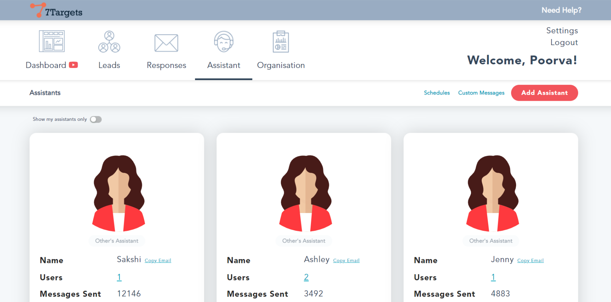
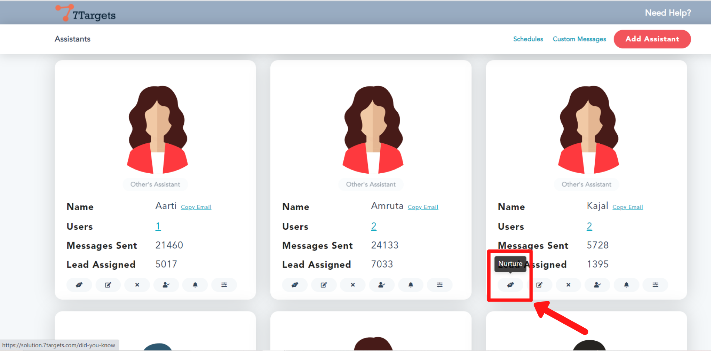
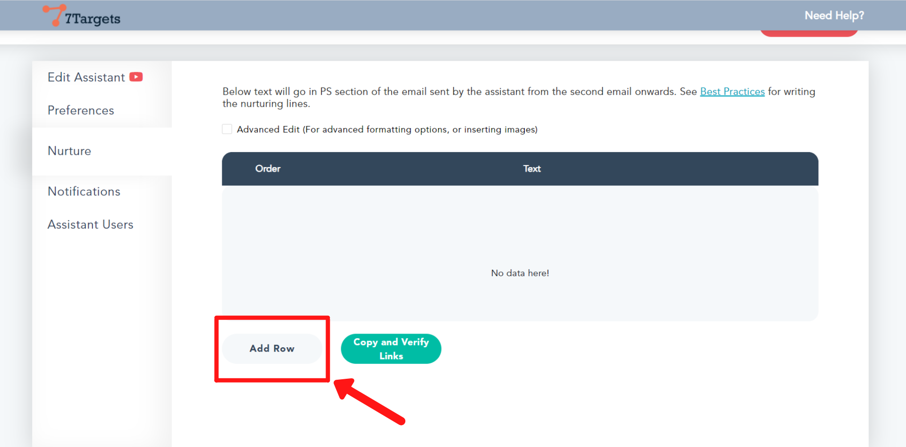
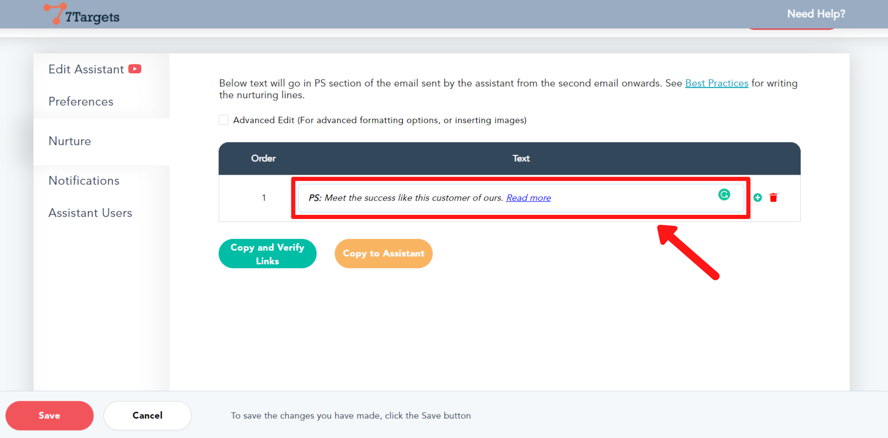
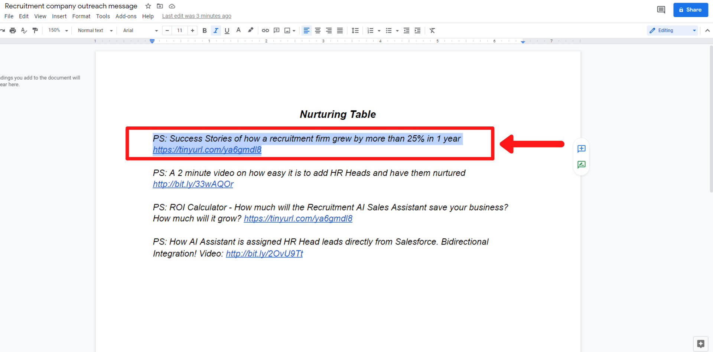
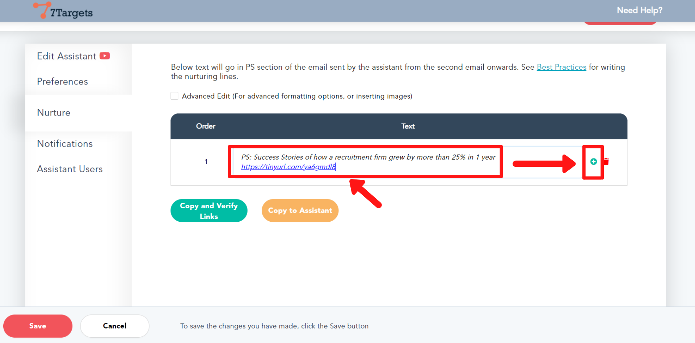
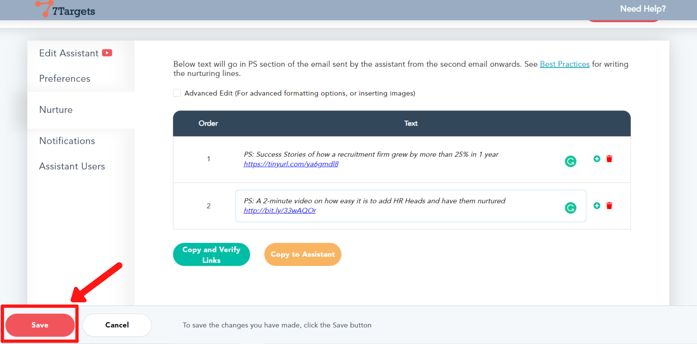

One of the most important features of 7Targets is lead nurturing. You can upload nurturing messages to each assistant in just a few simple steps. AI Sales assistant then dynamically attaches these nurturing messages to every follow-up email in the 'PS' section.

Follow these simple steps to upload the nurturing information.

## Step 1

Sign-in into your account.

Click on 'Assistant' as shown below.

You'll be directed to this page.

## Step 2

Select the assistant you want to add nurturing information to.

Click on the 'Nurture' button of that assistant as shown.

## Step 3

Click on the 'Add Row' button to add the nurturing message.

## Step 4

Now either you can edit the message in the section shown, or you can paste the already available message here.

This is a sample of how your nurturing messages can be. You should copy the messages one at a time.

## Step 5

Paste it in the section shown below.

To add the next message, click on the '+' (plus) button and then repeat step 4.

## Step 6

Click on 'Save' button at the left bottom corner. 

Since you can assign different assistants for different verticals, you may want to upload vertical-specific nurturing messages for the respective assistant.

If you have any further doubts you can directly mail us on info@7targets.com.