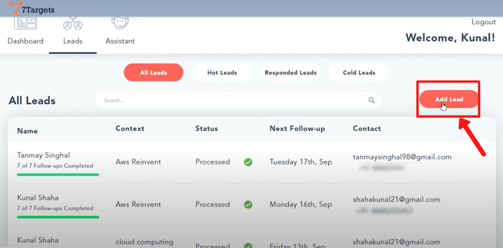
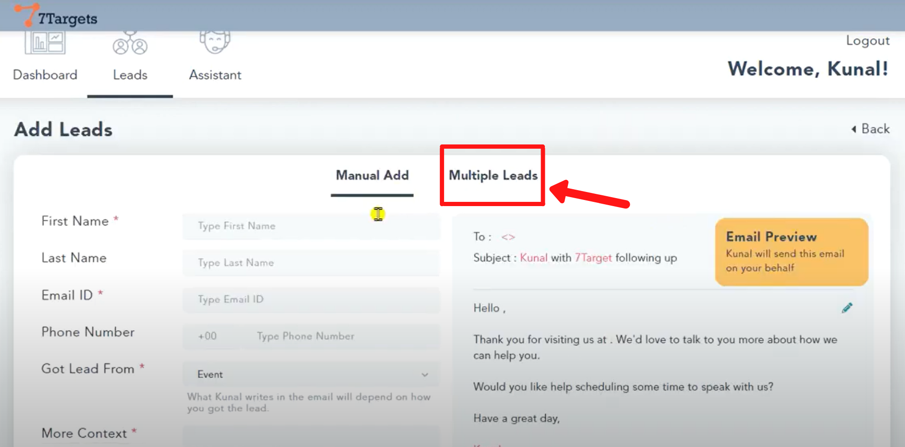
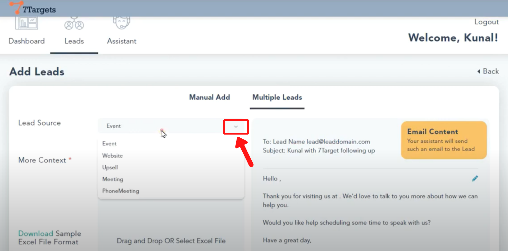
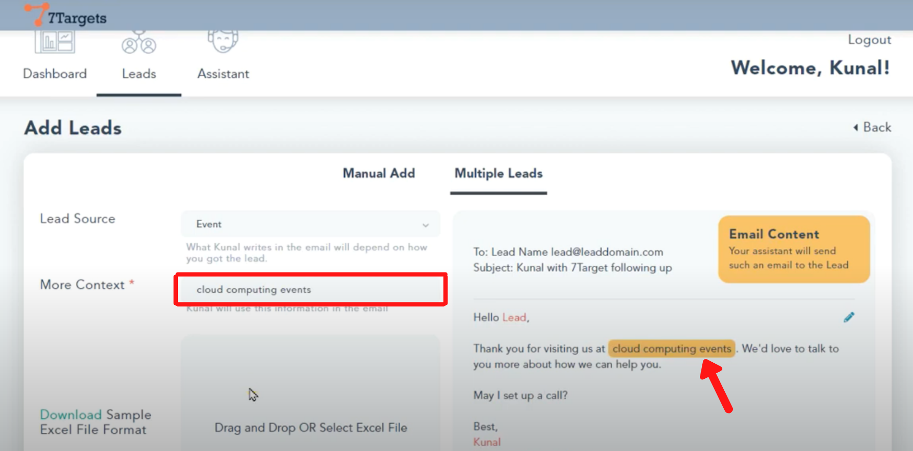
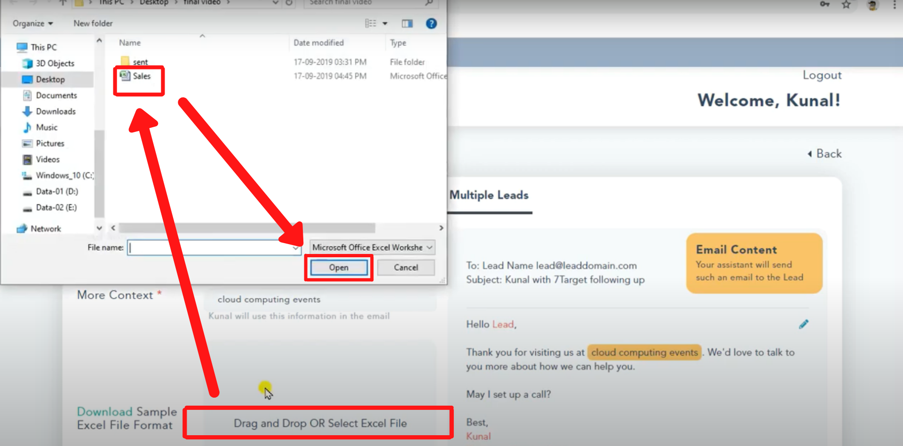
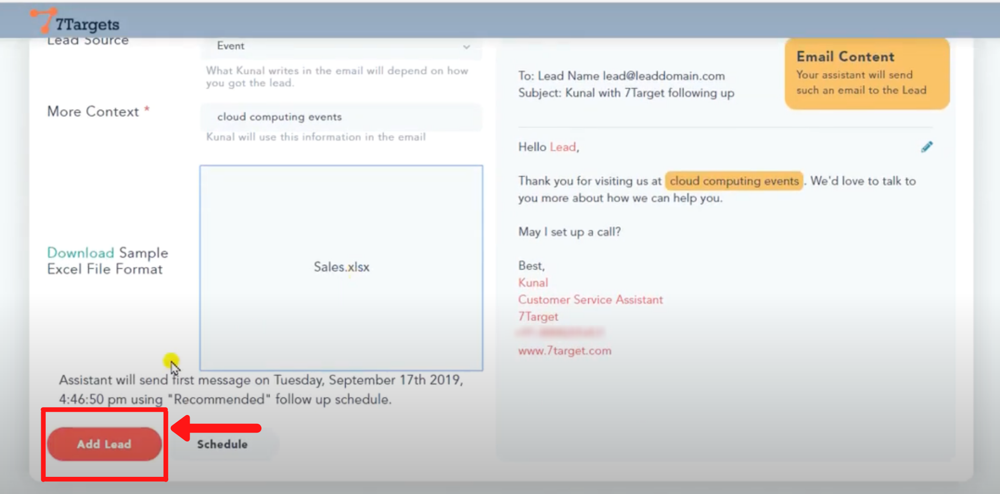
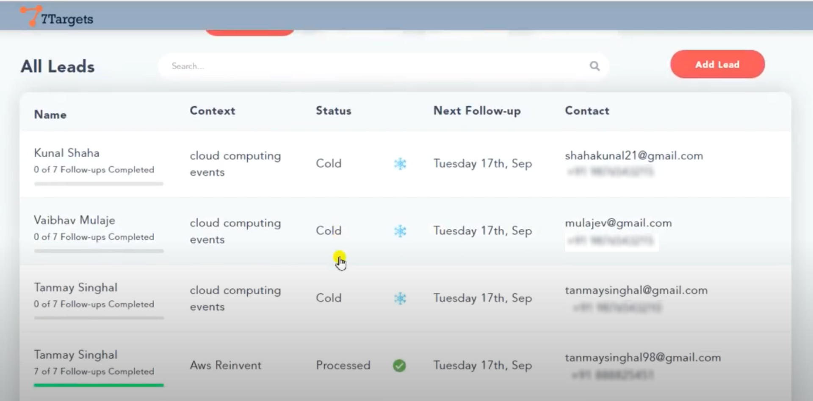

You can use 'Multiple Lead' option to directly upload leads from an excel sheet. This feature saves you a lot of time.

To know more about adding multiple leads please visit this page.

Here is a small video explaining the steps.

    <iframe src="https://www.youtube.com/embed/jrO-Ite3CTA" height="380" width="560" 
    allow="autoplay; encrypted-media"
    frameborder="0">
    </iframe>

Sign in to your account. Click on the 'Leads' option besides 'Dashboard' on top. Now follow these simple steps shown below:

## Step 1

Click on 'Add lead' button.

## Step 2

Select the 'Multiple Leads' option.

## Step 3

Click on the drop down arrow as shown below. Select the source from where you got the email list.

## Step 4

In 'More Context' field, add further details of the lead source.It helps assistant to construct more relevant sentences in the email. You can see the dynamic email constuction on the right side.

## Step 5

Here, you can directly drag and drop the excel sheet.

Else as shown below, click on 'Select Excel File'. Select the excel sheet you want to upload and then click on 'Open'. 

**Make sure the list contains all the leads from the same source.** 

## Step 6

Click on 'Add lead' button at the left bottom corner. 

You can now see all the leads are uploaded.

If you have any further doubts you can directly mail us at info@7targets.com.