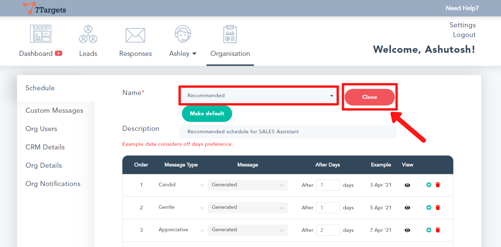
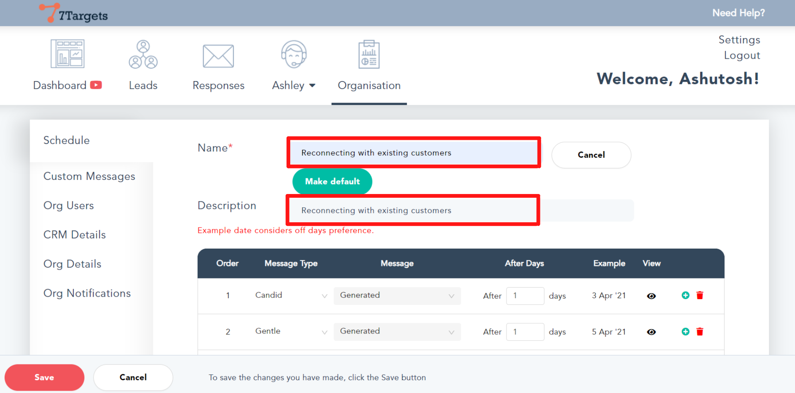
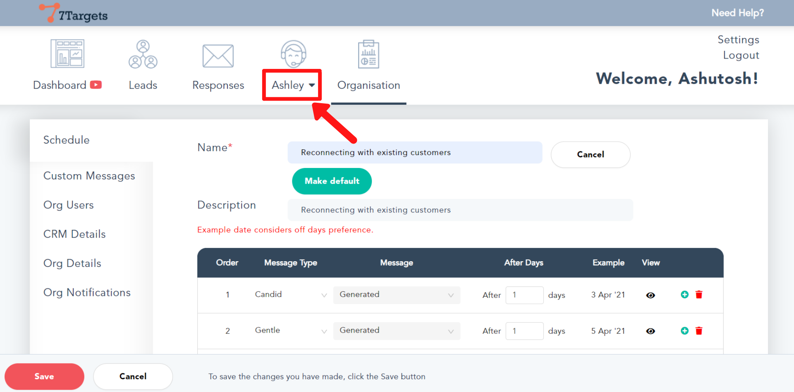
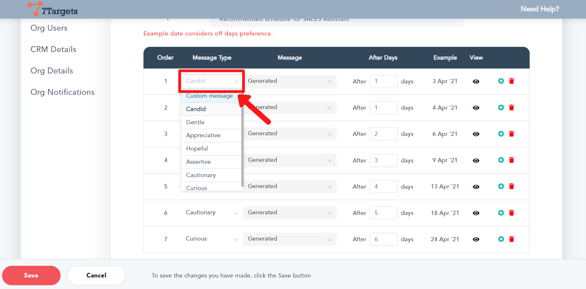
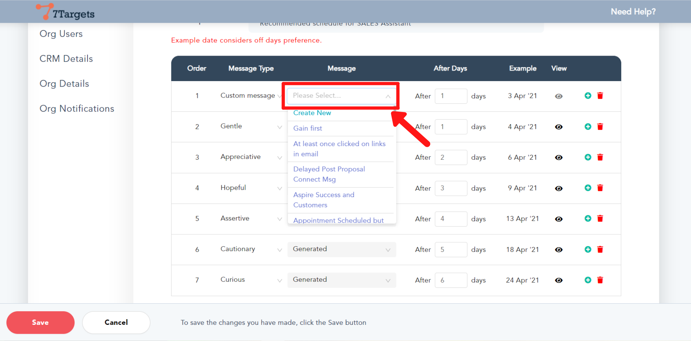
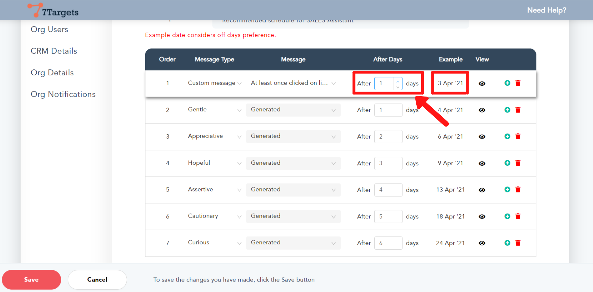
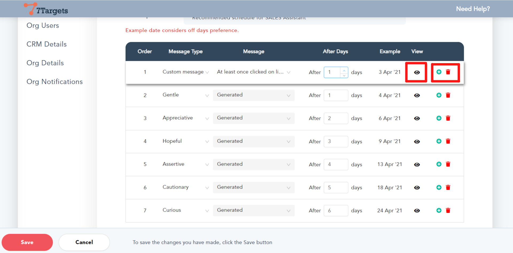
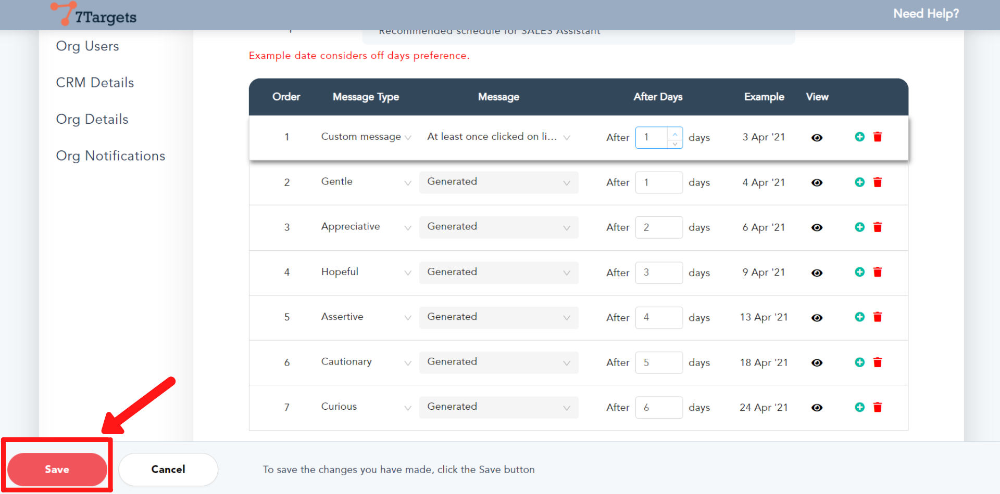
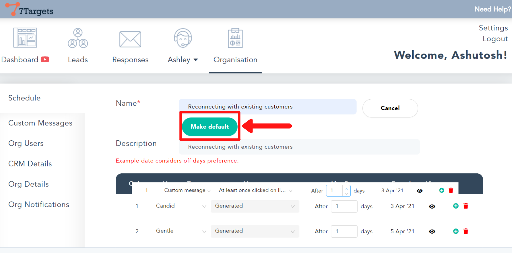

Schedule Sequence helps you decide how you want the assistant to followup. i.e.

**-** how many followups

**-** days between each followup

Assistant comes with two default schedules **Recommended** and **Recommended for Email CC**. You can clone from one of these schedules and create a new one, providing an appropriate name and description.

To know more about scheduling please visit this [page](https://help.7targets.ai/manage-org/organization-schedule/).

Follow these simple steps to create a new schedule.

## Step 1

Sign in to your account.

Click on the 'Organisation' Tab. The Schedule sub-tab is selected.

## Step 2

You can select from one of the already available schedules that you can clone.
After cloning you can make all the desired changes to it.

To select the schedule, click on the 'Name' field. Type "Recommended" to select that schedule. 

If you want to clone from some other Schedule then search the desired schedule and select it.

Now click the 'Clone' button.

## Step 3

Give a new name for the schedule that you are creating and add a small description.

## Step 4

Click on the drop-down arrow as shown. Select the AI assistant you want to assign the new schedule to.

## Step 5

Now, in the table, click on the drop down-arrow as shown and select the type of message. Typically we recommend creating the first message in the schedule as a Custom Message.

## Step 6

From the Message column, you can create a new or select from an existing custom message.

## Step 7

Now, change the 'After Days' value so that the message will be sent after the selected number of days. While you change this value, watch the example Date you are getting on the right side.

## Step 8

You can click on the 'View' icon to see the message.

On the right side, you can click on the add and delete icons on any of the rows to add a new message or delete one depending on how many messages you want to have in a schedule. 

## Step 9

Click on the 'Save' button at the left bottom corner after you have made all the changes to the schedule. 

## Step 10

After saving the schedule you may want to mark it default for the selected/specific Assistant. So that when you add leads for this assistant the default schedule is selected.

the custom schedule gives you the ability to pick the number of followups and the days between each appropriately, along with the messages to be sent on each followup.

If you have any further doubts you can directly mail us on info@7targets.com.