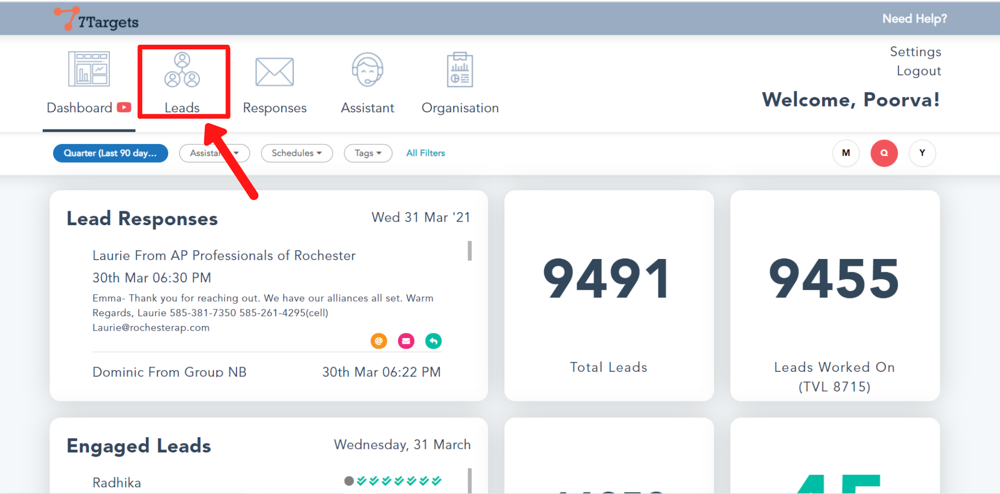
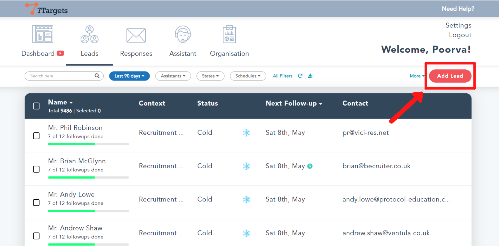
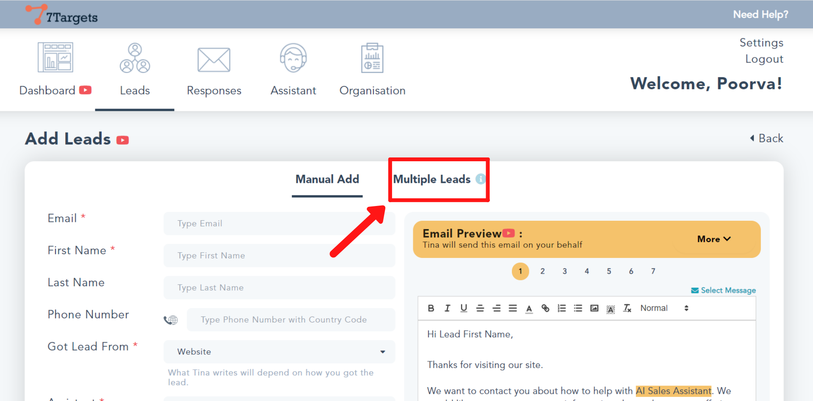
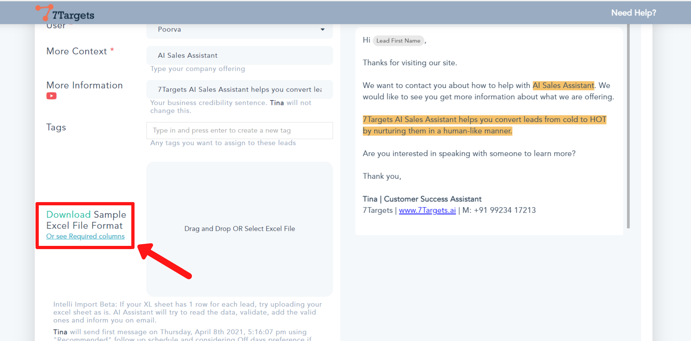

Follow these simple steps to arrange the leads' information in the required format.

## Step 1

Sign in to your account.

Click on the 'Leads' tab as shown below.

## Step 2

Click on the 'Add Lead' button.

## Step 3

Select the 'Multiple Leads' tab.

## Step 4

Scroll down and on the left hand side you'll see 'Download Sample File Format Or see Required columns'.

If you want to download the format and fill the columns, click on the 'Download' link.

And if you just want to see the required fields, then click on 'Or see Required columns'.

The downloaded file will look like this. Add the leads in this sheet.

**Make sure the list contains all the leads from the same source.** 

Once your sheet is ready, follow the steps under [How to upload multiple leads](https://help.7targets.ai/how-to-add-multiple-leads/).

If you have any further doubts you can directly mail us at info@7targets.com.