After you have setup the AI assistant, you can add further details to her such as signature, context, default schedule, brochure URL, etc.

If you haven't yet setup an assistant, do follow the steps under [how to setup an AI sales assistant](https://help.7targets.ai/how-to-setup-ai-sales-assistant/).

To know more about the details of the assistant please visit this page.

Here is a small video explaining the steps.

    <iframe src="https://www.youtube.com/embed/ELaE7f0mi4A" height="380" width="560" 
    allow="autoplay; encrypted-media"
    frameborder="0">
    </iframe>

Follow the steps below to add details to the AI sales assistant.

## Step 1

Sign in to your account. 

Click on the 'Assistant' tab.

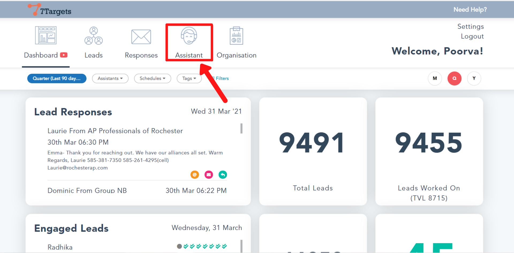

## Step 2

Select the 'Edit Assistant' option as shown.

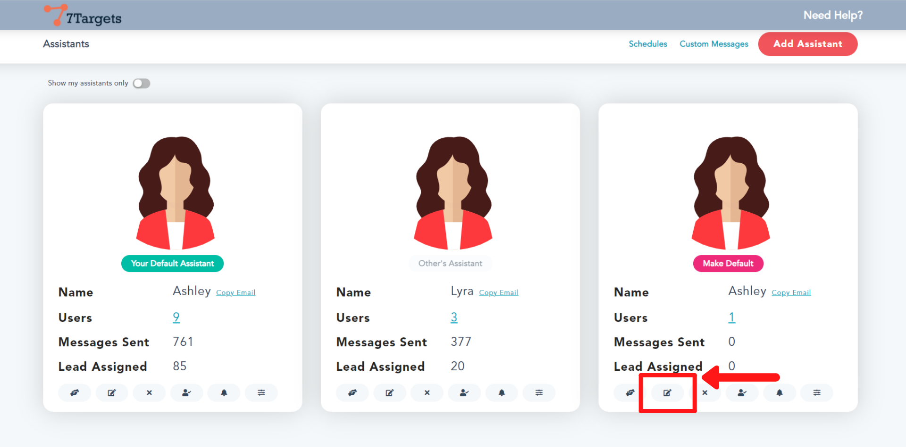

## Step 3

In the 'Name' field you can change the name of the assistant. Check that it changes the email id of the assistant too.

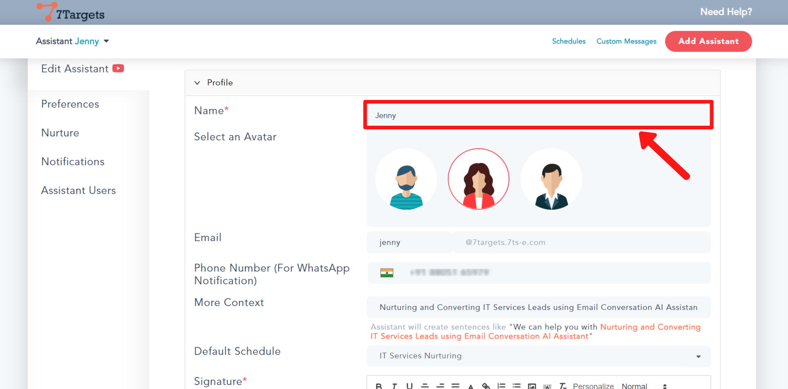

## Step 4

You can change the avatar of the assistant by selecting one of the three.

## Step 5

In the 'Email' field you can edit the email address of the assistant.

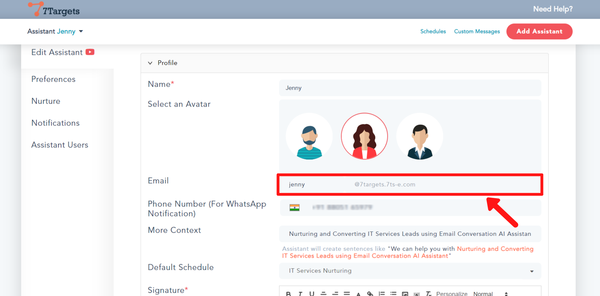

## Step 6

To get WhatsApp notifications, you can add the phone number in the field shown below.

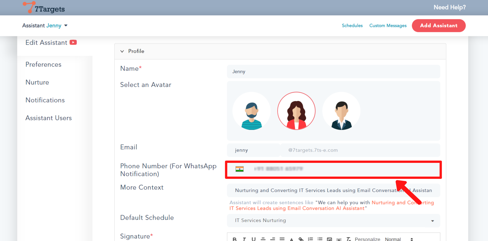

## Step 7

If you want the assistant to always build a sentence around a topic (such as one of your offerings), you can add it in the 'More Context' field.

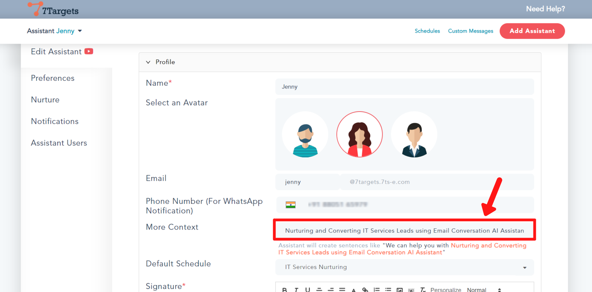

## Step 8

You can a assign default schedule to the assistant. Click on the drop-down arrow and select the desired schedule.

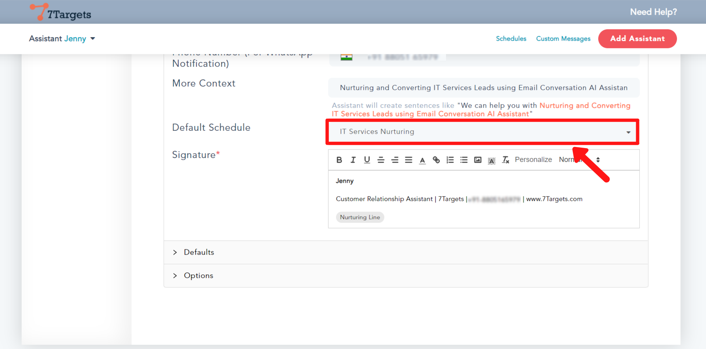

You can even create your own schedule. Follow the steps under [how to make your own schedule](https://help.7targets.ai/how-to-schedule-followups/).

## Step 9

In the 'Signature' field, you can edit the signature of the assistant.

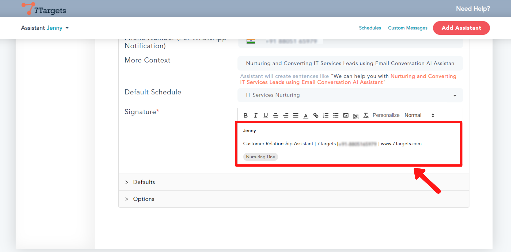

## Step 10

Now, click on the 'Default' option.

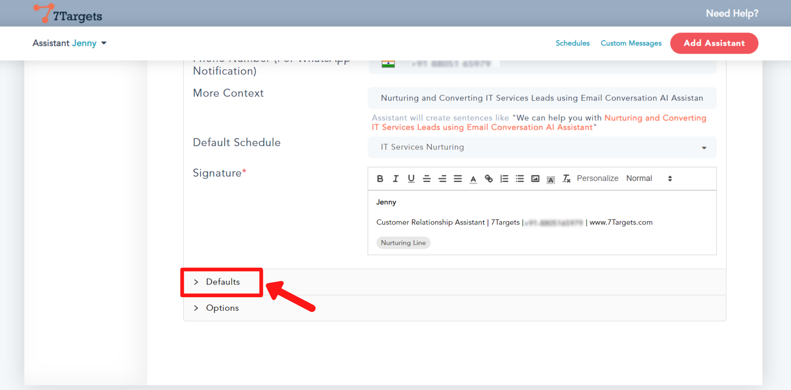

## Step 11

Default EmailCC Schedule is used by the assistant when the assistant is copied in the email by the user with the lead. For EmailCC schedule, the  assistant will start the with the second message in the sequence. Your email where you Cc’ed/Copied the assistant is considered as the first email.

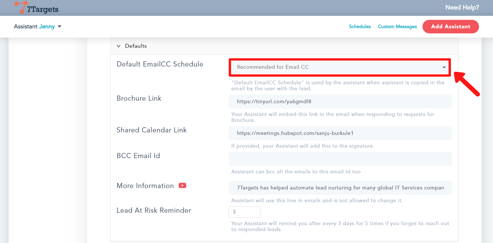

## Step 12

If you have a brochure, you can add the link of it in this field. So that whenever the lead asks for brochure, the assistant will embed this link in the email.

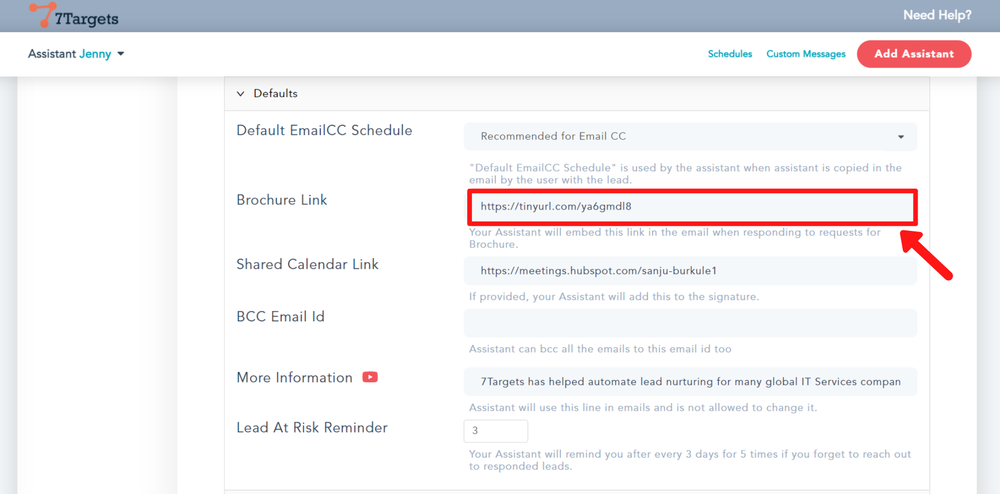

## Step 13

If you want to add the link of your calendar to the signature, add the calendar link in this field.

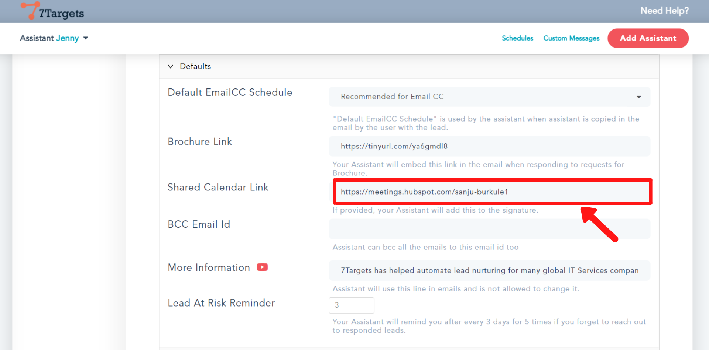

## Step 14

In the 'BCC Email Id' field, you can add the email id you want to bcc to.

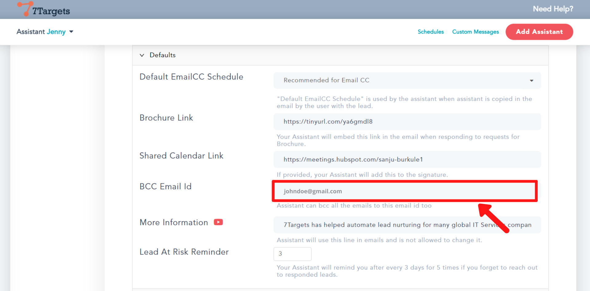

## Step 15

If you want a particular line to be always added and should not be changed by the assistant. Write the line in the 'More Information' field.

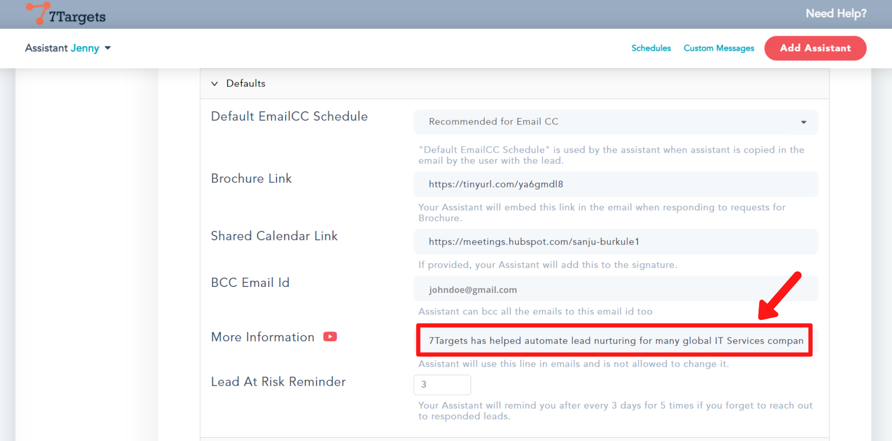

## Step 16

Here, you can set the number of days after which you should be reminded if you forgot to respond to a lead. For example here the number is set to 3 so, the assistant will remind you after every 3 days.

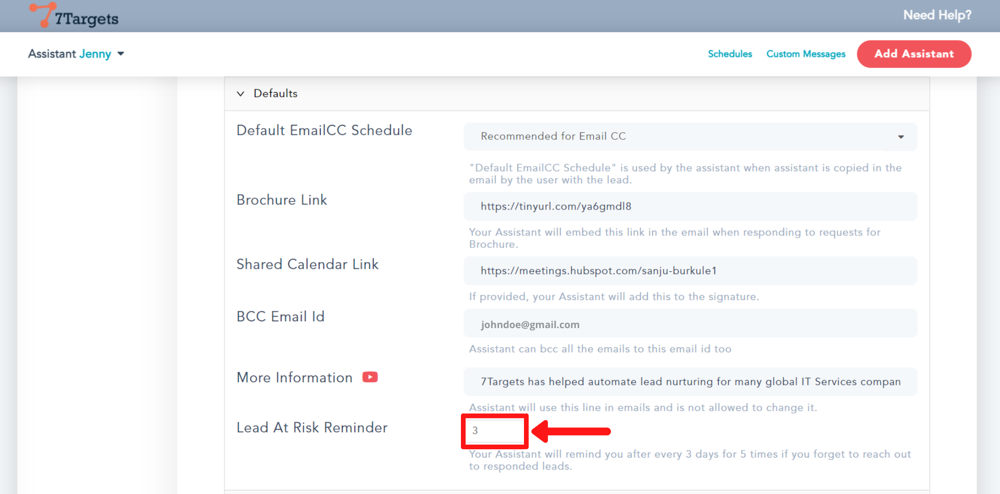

## Step 17

After making all the changes, click on the 'Save' button.

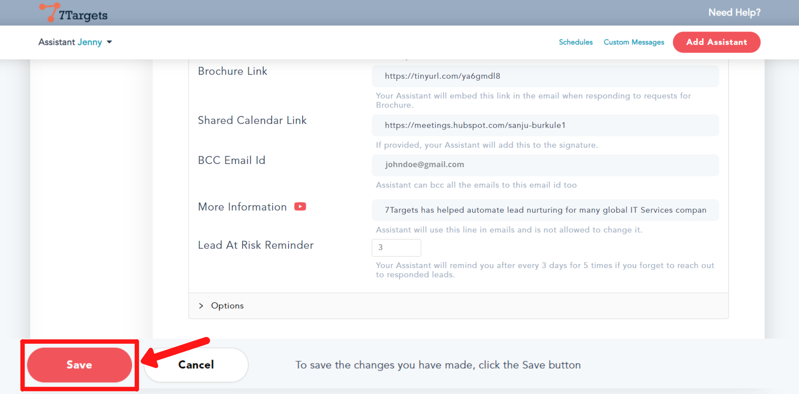

If you have any further doubts you can directly mail us at info@7targets.com.