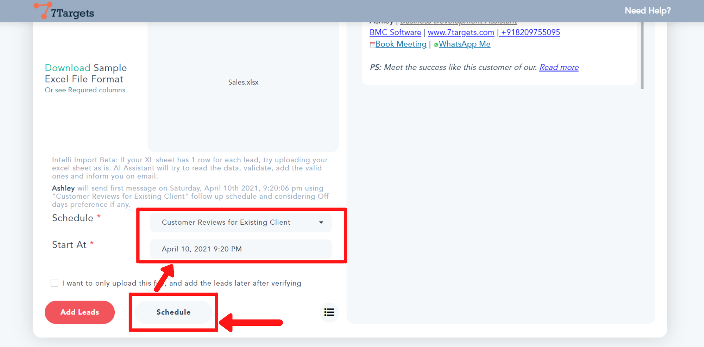
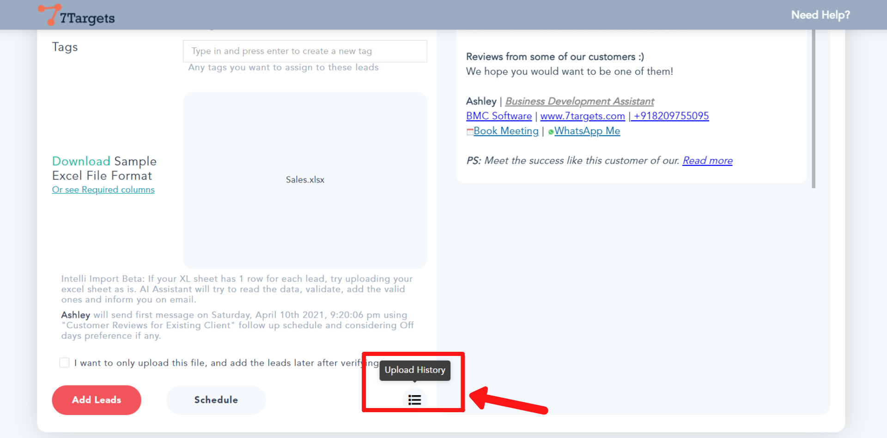
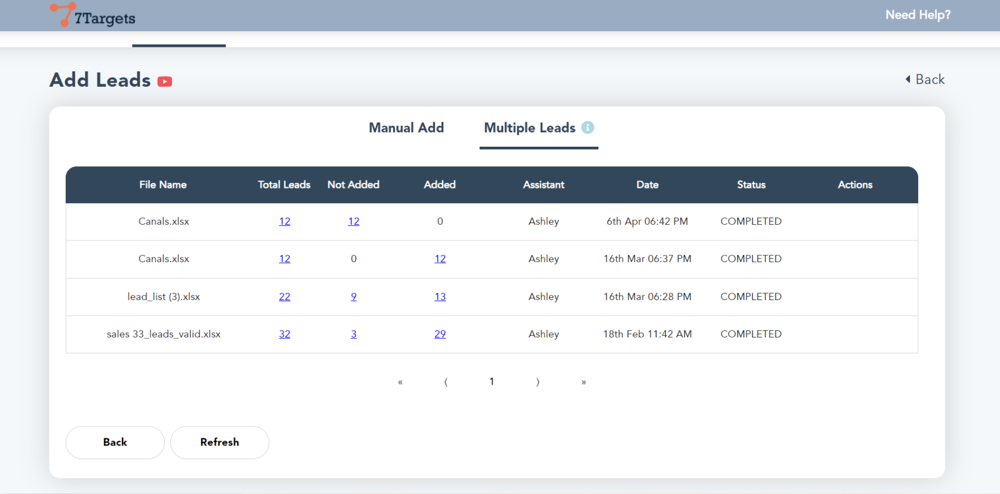

You can use 'Multiple Lead' option to directly upload leads from an excel sheet. This feature saves you a lot of time.

To know more about adding multiple leads please visit this page.

Here is a small video explaining the steps.

    <iframe src="https://www.youtube.com/embed/jrO-Ite3CTA" height="380" width="560" 
    allow="autoplay; encrypted-media"
    frameborder="0">
    </iframe>

Sign in to your account. Click on the 'Leads' option besides 'Dashboard' on top. Now follow these simple steps shown below:

## Prerequisite

Before uploading the leads, you should have an excel sheet ready in a proper format. The name, email id, company, designation, etc should be formatted so that you can upload multiple leads. 

If you haven't yet prepared the sheet, do follow the steps under [how to prepare an excel sheet to upload multiple leads](https://help.7targets.ai/how-to-prepare-excel-sheet-to-upload-information-of-multiple-leads/).

## Step 1

Click on 'Add lead' button.

## Step 2

Select the 'Multiple Leads' option.

## Step 3

Click on the drop down arrow as shown below. Select the source from where you got the email list.

## Step 4

In 'More Context' field, add further details of the lead source.It helps assistant to construct more relevant sentences in the email. You can see the dynamic email constuction on the right side.

## Step 5

Here, you can directly drag and drop the excel sheet.

Else as shown below, click on 'Select Excel File'. Select the excel sheet you want to upload and then click on 'Open'. 

**Make sure the list contains all the leads from the same source.** 

## Step 6

Now, to add the leads, click on the 'Add leads' button at the left bottom corner. 

## Step 7

You can assign schedule to these leads. Click on the 'Schedule' button. Select the desired 'Schedule' by clicking on the drop-down arrow. Then set the 'Start At' date and time.

Further, you can even create your own schedule to assign to these leads. Follow the steps under [how to make your own schedule](https://help.7targets.ai/how-to-schedule-followups/).

## Step 8

To check the upload history of leads, click on the button as shown below.

You'll be directed to this page.

Here, for a certain file, if you want to download the total number of leads. Click on its corresponding 'Total Leads'.

Similarly, to know the reason why certain leads aren't added, download it by clicking the corresponding 'Not Added'. The same is for the added lead, click on the correponding 'Added'.

Other details in this table are assigned assistant to the leads, date, status, and actions to be taken.

If you have any further doubts you can directly mail us at info@7targets.com.