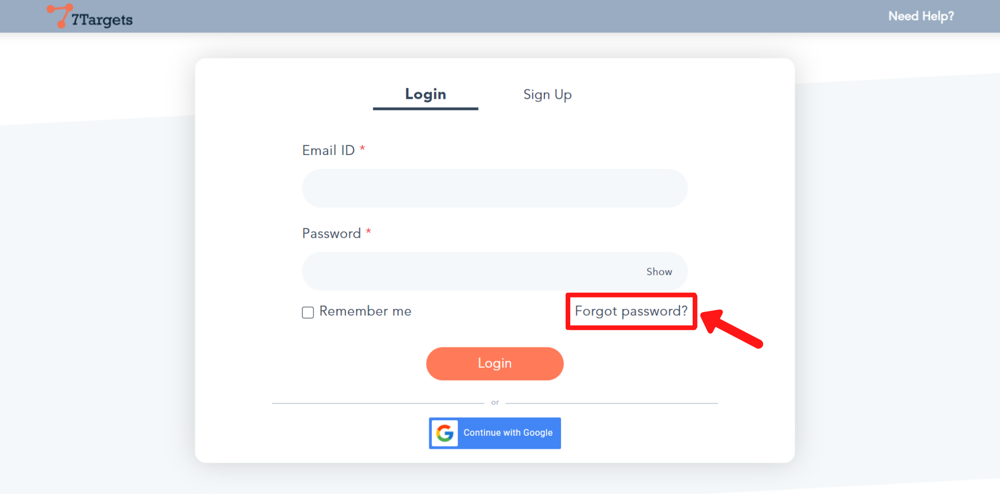
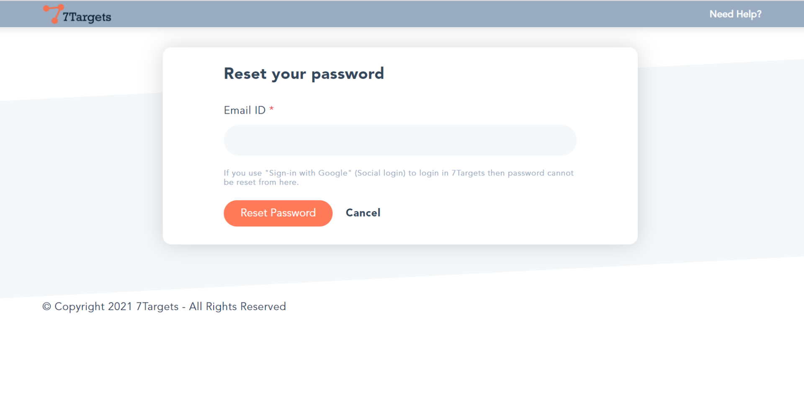
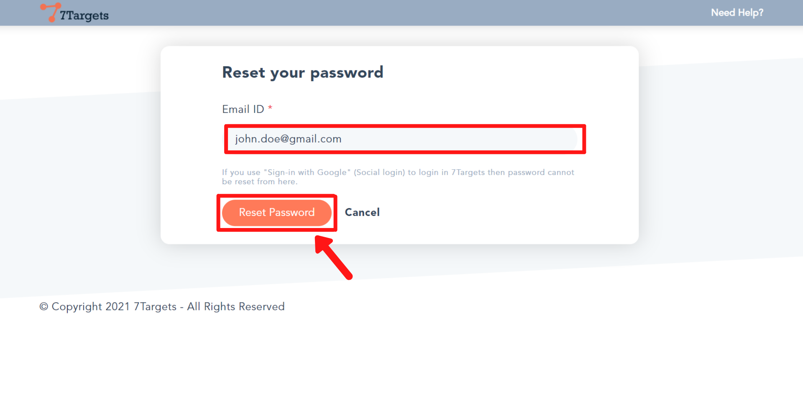
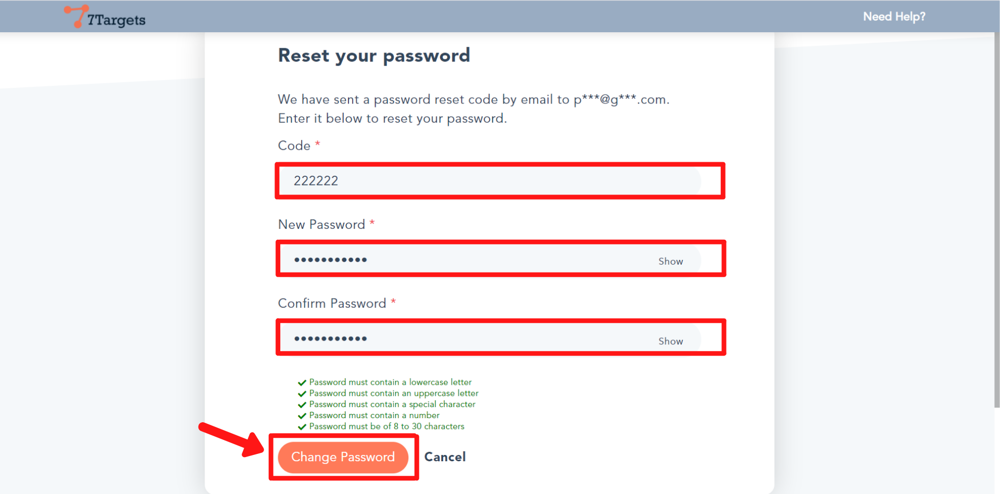
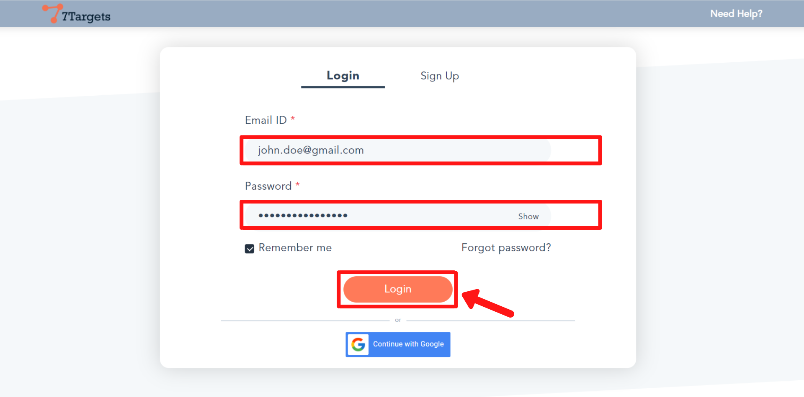

If you have forgotten your password, follow these simple steps to login again to your account.

**Note :** If you use "Sign-in with Google" (Social login) to login in 7Targets then the password cannot be reset.

## Step 1

Go to the [login page](https://solution.7targets.com/). Click on the 'Forgot Password?' link.

You will be directed to this page.

## Step 2
Enter your email address you have used while signing-up. Then click on the 'Reset Password' button.

## Step 3

When you click on the 'Reset Password' button, a code will be sent to the entered email address.

Enter the received code in the 'Code' field. Now, enter a new password in the 'New Password' field. Then confirm it by retyping the new password in the 'Confirm Password' field.

At the end click on the 'Change Password' button.

## Step 4

You'll be directed to the login page. Enter the email address and the newly set password as shown.

Then click on the 'Login' button.

If you have any further doubts you can directly mail us at info@7targets.com.